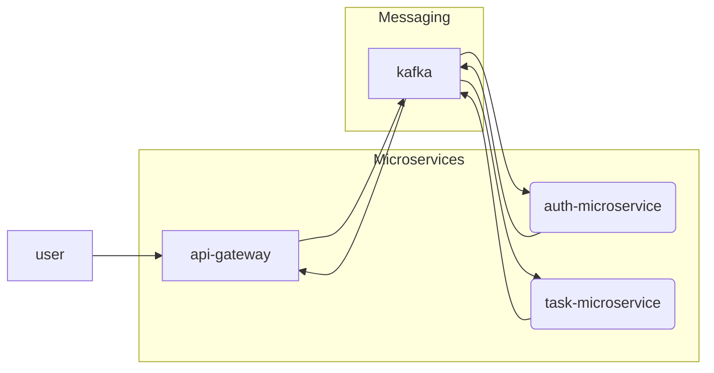

# NxNestjsMicroservices

<a alt="Nx logo" href="https://nx.dev" target="_blank" rel="noreferrer"></a>

✨ **This workspace has been generated by [Nx, a Smart, fast and extensible build system.](https://nx.dev)** ✨

## Development server

Run `nx serve api-gateway` for a dev server. Navigate to http://localhost:4200/. The app will automatically reload if you change any of the source files.

## Understand this workspace

Run `nx graph` to see a diagram of the dependencies of the projects.

## Remote caching

Run `npx nx connect-to-nx-cloud` to enable [remote caching](https://nx.app) and make CI faster.

## Further help

Visit the [Nx Documentation](https://nx.dev) to learn more.


## see:
> https://blog.logrocket.com/microservices-nestjs-kafka-typescript/

## Usefull commands

* Create `nx` workspace

```bash
npx create-nx-workspace@latest
```

* Create a shared library (in a folder named `shared`) for code sharing among microservices

```bash
nx g @nrwl/node:lib shared
```

* Create a microservice (named `new-microservice`)

```bash
nx g @nrwl/nest:app new-microservice
```

* Running a microservices

```bash
nx serve new-microservice
```

## Diagram




## Run

```bash
nx serve api-gateway
nx serve auth-microservice
nx serve task-microservice
```